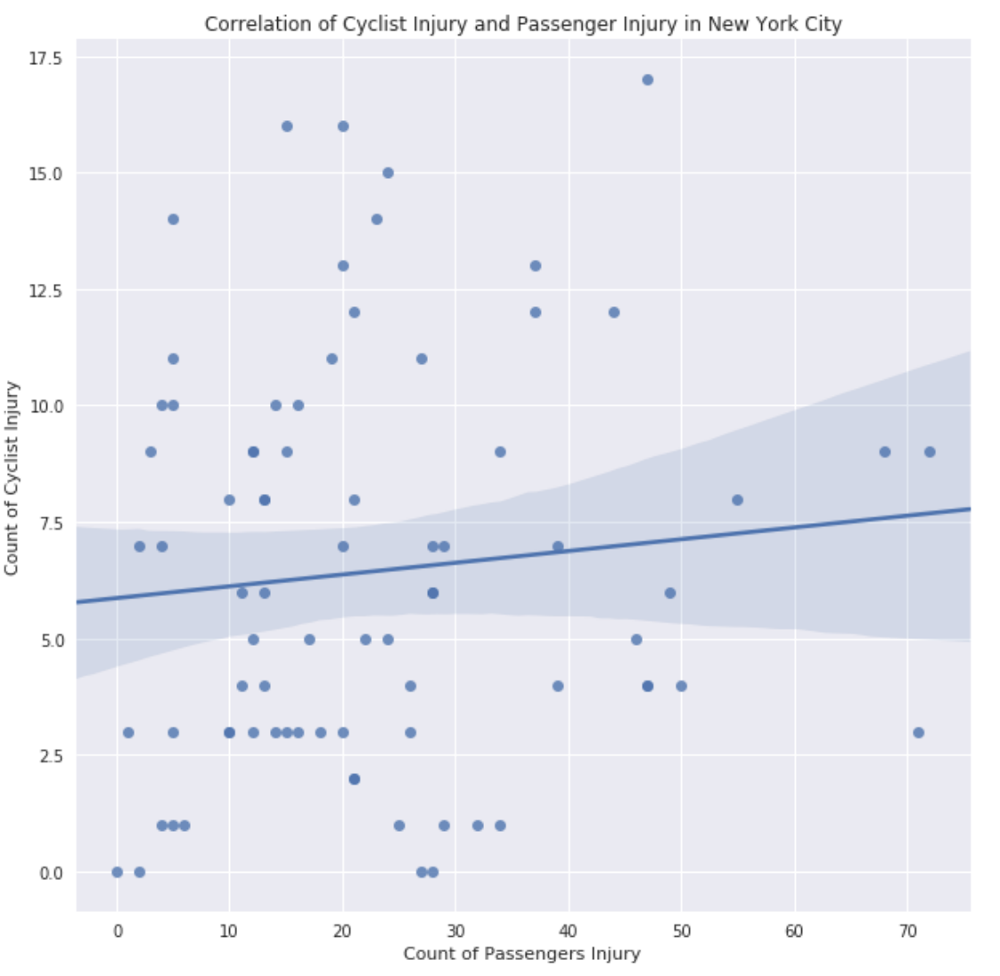

### Assignment 1 

Caption: The data was used for this assignment review different type of collision Passenger Injured vs Cyclists Injured. We can see that the two chosen variables demonstrate weak and positive correlation. 

### Assignment 2
Citibike and Gender Trip Duration: using T-testing to analyze the data based on gender trip duration/ridership. See HW8-2amk and link below for further information. 
https://www.authorea.com/users/249389/articles/335485--citibike-and-gender-trip-duration-mini-project
